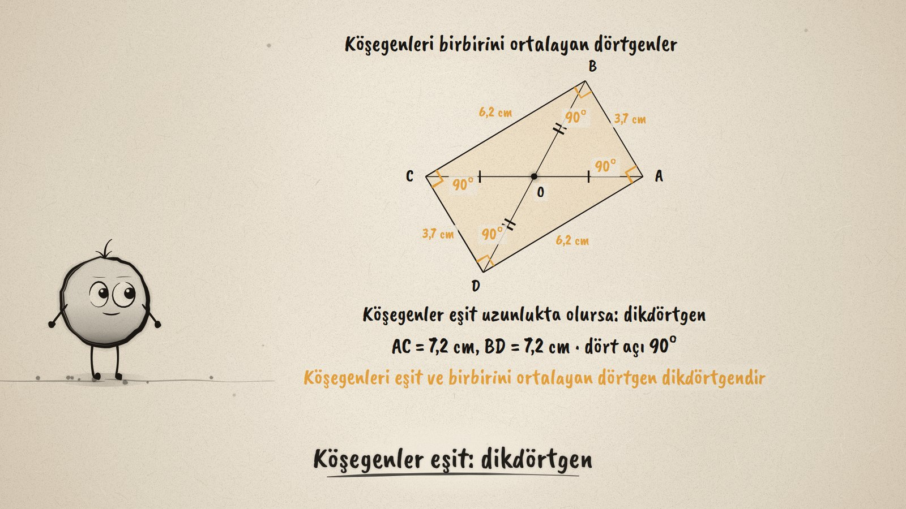
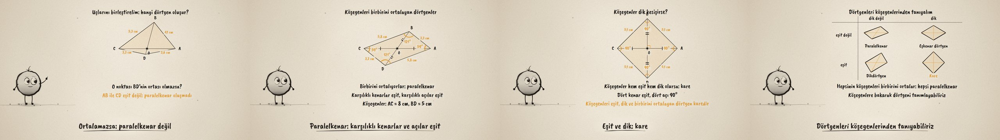

# Köşegenler Ortalarsa · Diagonals That Bisect Each Other

**▶ Tarayıcıda izleyin / Watch in the browser:** https://hakanatas.github.io/kosegenler-ortalarsa/ 
**⬇ MP4 + altyazılar / MP4 + subtitles:** [Releases](https://github.com/hakanatas/kosegenler-ortalarsa/releases) 
**✎ Kullanılan istem / The prompt behind it:** [PROMPT.md](PROMPT.md) 
**🎞 Bütün filmler / All films:** [Nokta'nın Filmleri](https://hakanatas.github.io/nokta-filmleri/?sinif=6)

> **TR —** 6. sınıf matematik "Geometrik Şekiller" temasındaki MAT.6.3.3 öğrenme çıktısı için hazırlanmış, tamamen JavaScript ile çizilen 92 saniyelik mürekkep animasyonu. AC ve BD doğru parçaları O noktasında birbirini ortalıyor; uçları birleştirilince AC ve BD dörtgenin köşegenleri oluyor. Varsayım: her seferinde paralelkenar oluşur. Köşegenler döndürülüp uzatılıp kısaltılıyor, kenarlar canlı ölçülüyor: karşılıklı kenarlar hep eşit. O, BD'nin ortası olmayınca kenarlar eşitliğini kaybediyor ve paralelkenar oluşmuyor. Sonra köşegenler eşit uzunlukta yapılıyor (dikdörtgen), dik kesiştiriliyor (eşkenar dörtgen), ikisi birden (kare); her biri bir önermeyle söyleniyor. Son olarak "Köşegenler eşit mi? Dik mi?" tablosu dört dörtgeni köşegenleriyle tanımlıyor. Altyazılar Türkçe, İngilizce ya da ikisi birlikte seçilebilir.

A 92-second ink animation for **6th-grade maths**, the third film of the third 6th-grade theme. Nokta, the ink character from [The Learning Ink](https://github.com/hakanatas/the-learning-ink), is the guide again. Every quadrilateral here comes from four numbers about its diagonals (`ST` in `src/draw/film.js`): the two half-lengths, the angle between them, and how far BD's midpoint is moved away from O. The side lengths on screen are measured from the drawing, so they change live as the diagonals turn.

## Learning outcome

MEB, Türkiye Yüzyılı Maarif Modeli, Ortaokul Matematik, 6th grade, "Geometrik Şekiller" theme:

**MAT.6.3.3. Matematiksel araç ve teknolojiden yararlanarak birbirlerini ortalayan doğru parçalarını köşegen kabul eden dörtgenlere yönelik çıkarım yapabilme**
- a) Birbirlerini ortalayan doğru parçalarını köşegen kabul eden dörtgenlere yönelik varsayımlarda bulunur.
- b) Birbirlerini ortalayan doğru parçalarını köşegen kabul eden dörtgenleri oluşturur ve listeler.
- c) Oluşturulan dörtgenleri varsayımları ile karşılaştırır.
- ç) Özelliklerine bağlı olarak birbirlerini ortalayan doğru parçalarını köşegen kabul eden dörtgenlere yönelik önermeler sunar.
- d) Sunduğu önermelerin dörtgenlerin farklı yollardan tanımlanmasına yönelik katkısını değerlendirir.

## Scenes

| # | Time | Scene | What happens | Outcome |
|---|---|---|---|---|
| 1 | 0–10 s | İki doğru parçası | AC and BD cross at O, the midpoint of both. | a |
| 2 | 10–28 s | Varsayım ve deneme | "Always a parallelogram": turning and stretching keeps opposite sides equal; moving O off BD's midpoint breaks it. | a, b, c |
| 3 | 28–46 s | Eşit köşegenler | Parallelogram (8 cm and 5 cm); equal diagonals give a rectangle. | b, ç |
| 4 | 46–66 s | Dik köşegenler | Perpendicular diagonals give a rhombus; equal and perpendicular, a square. | b, ç |
| 5 | 66–80 s | Köşegenlerle tanımla | A 2 × 2 table: equal or not, perpendicular or not. | ç, d |
| 6 | 80–92 s | Aklında kalsın | Bisect, then equal, then perpendicular. | ç, d |

## Running it

- **Preview:** double-click `index.html` (it works offline).
- **MP4:** run `npm install` once, then `npm run export -- --format=horizontal --captions=tr`.
- **Subtitles and narration:** `npm run srt` writes `out/captions_*.srt` and `narration_notes.txt`.
- **Editing:**
  - Caption text, timings and narration notes: `captions.js`
  - Everything on screen is drawn by `LI.world(t)` in `scenes/scene1.js` (which diagonals when in `KEYS`, the words, the table); the other scenes only set the camera.
  - The diagonals, sides, lengths, corner angles and Nokta's poses: `src/draw/film.js`; layout for 16:9 and 9:16: `src/draw/kd.js`

It uses the same engine as The Learning Ink: `renderFrame(t)` as a pure function of time, seeded randomness, and frame-by-frame export.
